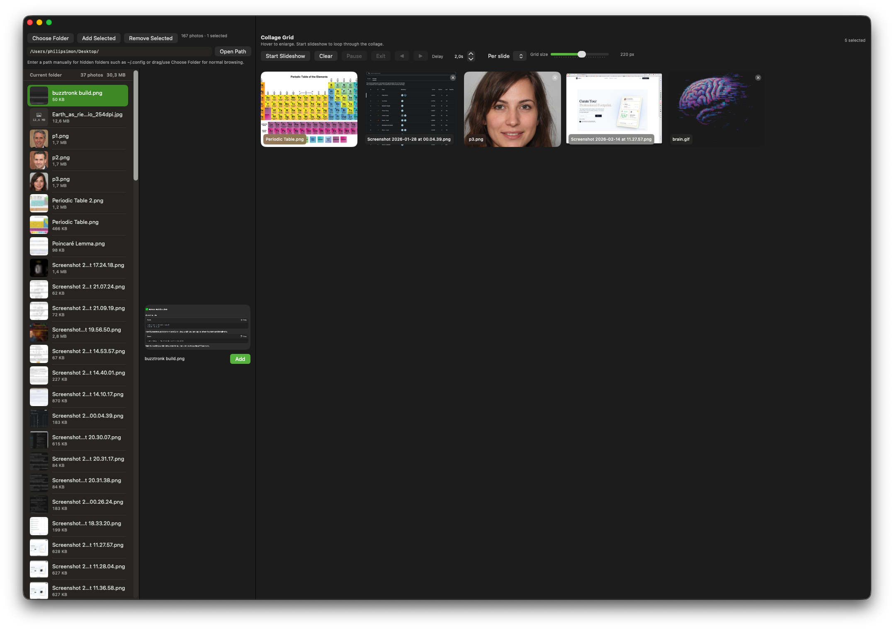
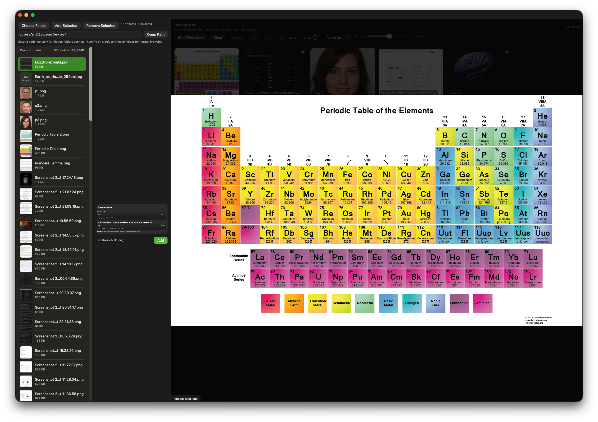
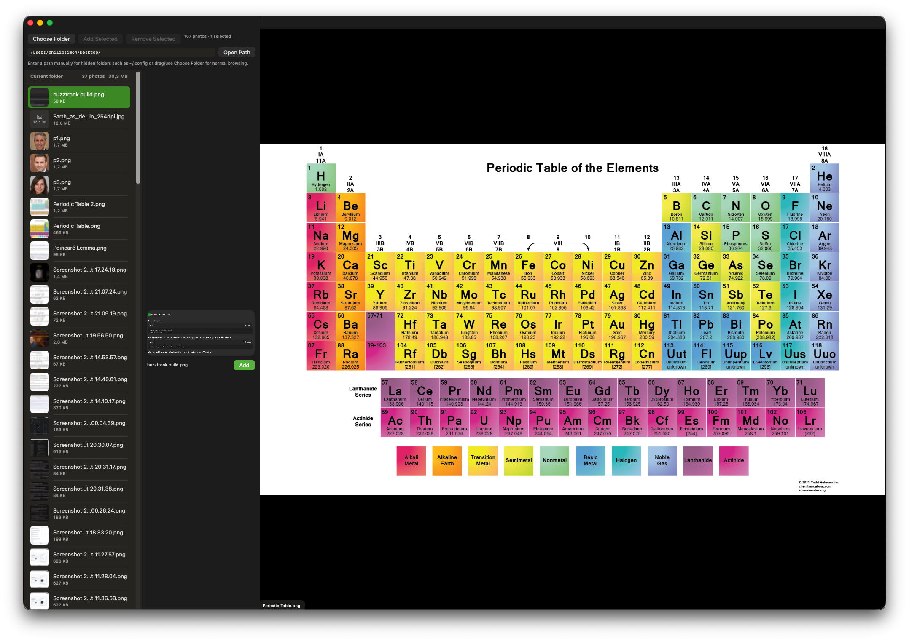

Image View is an image preview and slideshow app written in Swift.

# Hotkeys
| Key           | View/Env      | Function      |
| ------------- | ------------- | ------------- |
| Space         | Normal        | Add selected images to grid |
| Space         | Slideshow     | Pause/Resume slideshow |
| x             | Normal        | Remove selected images from grid |
| Escape        | Slideshow     | Stop slideshow |
| Arrow Keys    | Slideshow     | Next/Previous image |
| ⌘ + f         | Normal        | Path search |

# From the App
## Normal View

Of course multi-select is possible as well.
## Hover View

## Slideshow View

